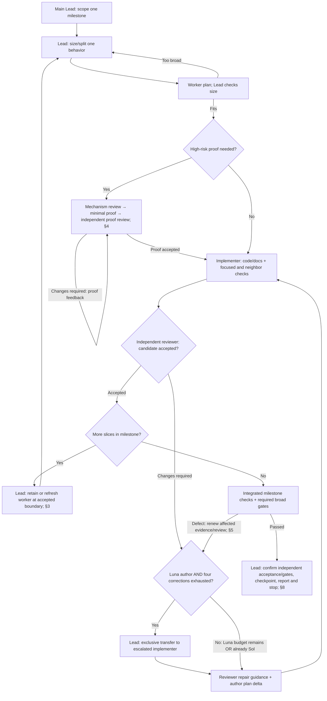

# Codex Specification Implementation

One approved assignment at a time. Deliver behavior, evidence, and independent acceptance; stop at the user's boundary.

## 1. Roles and authority

The main conversation agent is the single Lead. It owns scope, decomposition, coordination, user communication, progress checks and acceptance; do not spawn a separate Lead or supervisor.

| Role | Owns | Model / configuration |
|---|---|---|
| Lead (main agent) | Scope, slicing, dependencies, progress, blockers, user decisions, acceptance, stop boundary | Main thread: `gpt-6-sol`, `medium` recommended; not spawned |
| Implementer | Plan, tests, code, affected docs, verification | `luna_worker`, fixed `gpt-6-luna` / `max` |
| Escalated implementer | Remaining work after the initial Luna candidate and four unsuccessful corrections | `default`, `gpt-6-sol`, `medium` |
| Independent reviewer | High-risk mechanism/proof and substantive candidate review | `default`, `gpt-6-sol`, `medium` |

- Select the main thread's model/effort when starting the run; the skill cannot change its active model. Preserve explicit user selections. If the main model differs, disclose once and continue with that selection; never spawn a proxy Lead to obtain the preferred model. Subagents use `fork_turns: "none"`; default agents use the table's model/effort. If required roles/capabilities are unavailable, report and obtain a fallback choice before substitution, except §3's explicit context-refresh capacity fallback.
- Lead spawns at most one active implementer and one independent reviewer; slices run sequentially. No further delegation by workers/reviewer, nested leads, extra supervisor, or extra worktrees/databases merely to fill slots.
- Lead may inspect source/evidence, resolve routine decisions and edit prose/tracking; **no application/test/migration/build/runtime/script edits**, including small fixes or code conflict resolution. Explicit skill editing is exempt. Reviewer is read-only, never accepts its own implementation, and substantive blockers cannot be waived by Lead.
- Replacement author takes exclusive ownership after the former author stops editing; never overlap Luna/Sol writers.
- Work on one bounded milestone per run. Lead handles in-scope blockers and progress checks (§7), without another assignment, duplicate routine reviews or command polling. Use existing user authority; ask the user only for unresolved material requirement/scope/authority conflicts. No commit, publish, deploy, usage reset, or paid-setting change beyond existing authority.

## 2. Resume and tracking

Resolve the spec directory and read applicable repo instructions. Lead reads governing scope/acceptance/stop requirements and the relevant spec, source and build/test details. Ask only for unresolved target/material requirements. Preserve exact step names, dependencies, existing edits, accepted decisions and valid verification.

| File | Exclusive owner | Contents |
|---|---|---|
| `progress.md` | Lead | Accepted milestones, durable decisions, historical evidence links and pause/completion handoffs. No worker diary or duplicate live state. |
| `status.md` | Lead | Current objective, slice sequence/brief, decisions, agent IDs/ownership, proof/findings/attempt counts, blockers, execution agreement, next action/evidence and current progress-check record (§7). Replace stale state; aim ~60 lines, necessary facts take priority. |

Create missing tracking files for implementation, not skill discussion/editing. Keep live state in status and accepted outcomes in progress; link evidence rather than copying histories. Checkpoint meaningful changes and before planned pause/handoff. No simultaneous writers.

On resume/compaction, read status and relevant progress decisions; reconcile with newer user instructions and verify relevant current source/evidence. Tracking never overrides requirements. Retrieve history only for a concrete gap; do not reload everything or rerun valid gates. Reopen settled decisions only for new instructions or evidence of invalidity; record why.

When resuming the former two-coordinator workflow, obtain a finite handoff from any active delegated coordinator and end its coordination role before taking ownership. Preserve child IDs, findings, attempts, execution/cleanup obligations and check deadlines; reuse existing children when supported. Do not duplicate writers or interrupt active commands blindly. If child control cannot transfer safely, report the capability blocker rather than keeping two permanent coordinators or spawning replacements over active work. Move the current check record to status once; preserve historical progress entries.

## 3. Dispatch and slicing

Lead identifies the one approved milestone/outcome for this run and records requirements, dependencies, scope/exclusions and acceptance/stop conditions in status. A broader specification does not implicitly authorize continuing to the next milestone. Lead owns decomposition and dispatches workers directly; no extra managerial approval stage.

**Size Luna work before dispatch:** Lead inspects actual source/dependencies and assigns one independently verifiable behavior at a time, not an entire numbered milestone by default. Each brief names the outcome, governing contracts/existing patterns, owned scope/exclusions, decisive acceptance scenarios, focused checks, and consuming integration/remaining work. In the existing brief/status, record the sizing decision in one sentence: fits as one behavior, split into dependent slices, or inseparable coupled mechanism with reason.

Split when independent mechanisms need separate design decisions (e.g. codec, quota lifecycle, expiry, publication races), or unrelated scenario families prevent one clear acceptance boundary. Keep a transaction and its atomic effects, rollback, authorization, and necessary shared-contract changes together; do not separate quota reservation from the session mutation it protects. Size by behavior and dependencies, not files, layers, time caps, or a rigid test count. Avoid tiny slices that duplicate setup/review without isolating a behavior. A small slice can still be high-risk and must follow §4; sizing does not change the model/escalation rules (§1/§5). No scaffolding-only slices, speculative interfaces, scope expansion, or skipped gates.

Keep one Lead for the milestone, one active implementer, and the same independent reviewer; slices run sequentially. Preserve established contracts, source/evidence and unresolved attempt counts (§5) when splitting or resuming. Choose worker context using the boundary rule below. No extra planner, managerial approval stage, or per-slice document.

**Worker context at slice boundaries:** After independent acceptance of a behavior, Lead checks whether the next slice is independently verifiable and the current worker history is dominated by completed work (e.g. repeated compactions or a materially different mechanism). If so, use a fresh Luna worker with `fork_turns: "none"`; do not carry the entire milestone history forward by default. Reuse a compact context for closely coupled continuation, and always reuse the current author for unresolved proof/candidate corrections. No timer-based rotation, refresh during active execution/review, or new Luna budget for unresolved behavior; an escalated behavior stays with Sol (§5).

Before replacement, obtain the accepted worker's final checkpoint and confirm it stopped editing, with no active command or restoration obligation. Lead retains the same reviewer and supplies only the next behavior's relevant contracts/source locations, accepted evidence, unresolved findings/counts, execution agreement and remaining integration. Record author ownership in status; do not reload old transcripts or repeat valid gates. Returning does not guarantee a free agent slot: use a supported retirement mechanism if available. If capacity prevents a fresh worker, record that limitation once and reuse the idle author with the focused brief; do not invent context clearing, exceed capacity, or replace the reviewer to free a slot.

**Focused handoffs (all roles):** Supply assigned outcome/requirement IDs with exact spec sections; owned components/files and shared resources; dependencies/exclusions; inputs/outputs/errors/effects and shared contracts; relevant evidence, missing scenarios, unresolved findings/repair guidance, next artifact, verification, and remaining integration. Link source documents with section/function/test locations; quote only essential constraints. Do not paste entire specs, project handbooks, conversations, or completed finding histories. Recipients read applicable instructions and referenced requirements; retrieve more source/context for concrete dependencies or uncertainties. Preserve required workflow rules below, acceptance criteria, attempt counts, and ownership/restoration obligations. No arbitrary context cap or separate handoff document. Corrections to the same agent carry changed scope/source, unresolved findings, new evidence, and plan delta; fresh replacements receive the complete relevant assignment state.

**Workflow map:** Read as text; no rendering step needed. Roles/models/effort: §1. This overview does not replace detailed rules; §4 governs proof, §5 candidate counting, §6 verification, and §7 progress checks/pause at every stage.

Luna candidate budget: initial submission + up to four corrections (five attempts total); explicit inability also follows §5. Early-proof feedback is separate, not automatically a candidate attempt. Sol retains correction ownership after escalation. Lead verifies that slices compose into the milestone; slice review is not final acceptance. For a single slice, the boundaries coincide. Preserve any repo/plan-required earlier gates.

Outside proof/candidate checkpoints, workers act autonomously; no permission per edit/test/RED/run. Serialize conflicting fixtures, build outputs, databases, ports, and servers without repeated test-slot transfers.

Every brief states role, ownership, governing paths, shared workspace/preserve-others rule, and applicable workflow. Lead reads this skill. Workers receive plan/proof, repair-guidance use, review-before-broad-gates, attempt, pause, communication route below, and §6 execution agreement/ownership/stall rules (batched notice, autonomous repairs/runs/handle resumes, five-minute check, one recovery) explicitly. Reviewer briefs include §5's repair guidance and finite-request/return lifecycle. All briefs include §6's concise-output practice: retain verbose logs, return result/evidence links and relevant failure excerpts, retrieve further output for a concrete gap. **Every worker/reviewer/escalation brief includes §6's waiting rule verbatim; Lead obeys it too**. Paths alone do not transmit rules to fresh contexts.

**Actionable notifications:**

| Route | Notify for |
|---|---|
| Worker → Lead | Required plan/delta, review-ready proof/candidate, blocker/decision, slice execution agreement or material change, execution blocker (§6), completed verification |
| Lead → user | Meaningful progress, accepted milestone, stopping boundary, pause or decision/capability blocker needing user action |
| Lead → reviewer | Ready review material (§5); material corrections during active review |

Batch related findings/evidence into one handoff: change/outcome, blocker/decision if any, next action, evidence link. Do not delay urgent correctness/safety blockers, required pre-code plans, initial/materially changed execution notices, or pause/ownership acknowledgments. No acknowledgment-only chatter, duplicate notifications, routine “starting/still running” messages, or repeated reports of unchanged state. Include these notification rules in recipient briefs. Keep routine plans, proof exchanges, findings, retries, test results and execution tracking within Lead/worker/reviewer and `status.md`. Lead communicates useful outcomes to the user without relaying internal chatter or requesting duplicate reports. Required user updates use known state, not extra team inspections.

**Communication route:** At first dispatch, establish the recipient's actually exposed native messaging capability once, using tool definitions and the first necessary plan/notice; no extra handshake. Separately exposed collaboration APIs need not appear in a nested tool registry; registry absence alone does not prove unavailability. Use returned agent IDs. Lead records the working route or finite-handoff fallback alongside ownership in status and includes it in follow-ups. Recheck only after an actual capability failure or changed runtime, not each turn/compaction. Do not repeatedly search for tools, read parent task history, or use separate user-owned task messaging to communicate. Missing messaging uses §6's fallback; missing required delegation/reactivation follows §1. Workers/reviewer may discuss agreed contracts directly where supported; Lead resolves decisions. Use the worker-context boundary rule above; corrections preserve the current author and counts.

## 4. Plan, prove, implement

**Before editing:** Luna inspects relevant source/tests/requirements and publishes a concrete plan to Lead for every assignment/correction. Read-only investigation/baselines may precede it; private reasoning is insufficient. Include approach, affected files/functions, reuse, change order, tests, uncertainties. Small changes need only a few bullets. Sol likewise publishes its revised approach. Store plan summary/link in status. For corrections, worker checks §5's repair guidance against source and publishes only the plan delta: adopted approach, evidence-backed deviations/uncertainties, changed scope/order/tests, and why the failed approach changes. Do not independently recreate the reviewer's diagnosis or full plan; investigate concrete gaps. Worker retains local implementation judgment. Reuse valid plans; no duplicated specs or per-fix plan files. Lead checks scope/dependencies/feasibility and the §3 sizing decision against every worker plan without duplicating technical review. If inspection reveals extra mechanisms, unsettled shared contracts, or substantial new dependencies beyond the brief, worker reports the sizing mismatch before expanding code; Lead narrows/splits the remaining work or explains why it is inseparable, updating the existing brief/status. Preserve valid work/evidence/counts. Pause only work dependent on that scope decision; ordinary in-scope work needs no acknowledgment. Include this expansion boundary in worker briefs.

**Shared-contract test selection:** When changing a shared contract, include a short map in the existing worker plan: changed field/version/enum/key set or behavior → affected producers/consumers → existing compatibility/contract tests. Cover relevant API/UI, persistence, readiness/job inventories, localization/docs, and E2E boundaries, not every category by default. For global counts/readiness queries, identify fixture producers and their owned cleanup; run producer/consumer tests together where isolation or ordering matters. Locate actual tests rather than copying stale plan class names. Record gaps; add meaningful coverage only where missing. No extra planner, document, or permission gate.

**Mechanism:** For stateful/async/concurrent work, name operation identity, durable target association, surviving facts after restart/expiry/deletion, later lookup/authorization, atomic commits, rollback/pending/replay/late-result behavior. Identify actual fields/queries/boundaries or necessary additions; “handle recovery” is insufficient.

**High-risk checkpoint** applies to authorization, provider/payment effects, destructive changes, migrations, concurrency, recovery:

1. Reviewer traces decisive scenarios. Worker proposes 1–2 early proofs: real entry point, observable state/effects (persisted where relevant), decisive failure/replay/race condition, test. In the existing pre-code exchange, reviewer checks missing facts/lookups/authority/atomic boundaries and whether scenarios expose broken mechanisms. Consolidate feedback; resolve correctness blockers before production edits.
2. Worker implements the smallest complete path for those scenarios, then submits source marker, test location, command/result, and actual assertions through Lead to the same reviewer. Freeze that proof scope during review; **do not expand surrounding implementation yet**.
3. Reviewer inspects executable proof/evidence, not test names/counts. Cross the real application/persistence boundary relevant to risk. Private-validator reflection, method-existence/source-text checks, or mocks bypassing that boundary do not substitute. Reuse fixtures and valid evidence.
4. Lead records acceptance/missing scenario in status. Expand implementation only after reviewer acceptance; then continue autonomously. One bounded checkpoint per risky mechanism, not full candidate review, extra managerial approval, agents/documents, or per-test permission. Reopen only for material mechanism change or invalid evidence, using the same reviewer.

Ordinary low-risk work proceeds after plan publication without acknowledgment or this checkpoint. For new behavior/bugs: meaningful focused RED → implementation → verification; existing tests may supply RED. Compile/setup failures alone are not behavioral proof. Test observable contracts, not invented signatures/structure/wording. Correct faulty tests against requirements with reasons; never weaken valid assertions or alter correct behavior for invented contracts. Preserve repo-required checks.

**Local stalls:** Worker surfaces repeated investigation without new evidence, ineffective fixes, or inability to deliver the next artifact. Lead watches planning/review loops too. Interrupt the unproductive pattern with one diagnostic handoff: failing outcome, tried/ruled-out approaches, obstacle, proposed change. Clarify mechanism, narrow scope, or consolidate ownership; status-only redispatch is not progress. Lead brings unresolved obstacles beyond existing authority to the user. Unresolved execution/approval calls use §6's earlier capability diagnostic, not the scheduled progress-stall counter.

Elapsed time, expected RED, or long tests alone are not stalls. Environment-only failures do not consume attempts, but persistent environment blockers still require diagnosis/supervision. Proof feedback is not one attempt per test; explicit inability/submitted acceptance candidates follow §5. Never keep an exhausted candidate indefinitely “in progress” or “awaiting proof.” Lead's scheduled stall counter is separate (§7).

## 5. Candidate review and escalation

Independent reviewer examines complete affected request/recovery paths for every substantive slice; judge risk by behavior, not diff size. Mechanical corrections stay in existing review. Each blocker: concrete trigger, violated requirement/risk, location, observable impact, closure evidence. No preference/speculative-redesign blockers. Consolidate feedback; flag urgent issues early only to prevent wasted/unsafe work.

**Actionable repair guidance:** With changes-required feedback, reviewer supplies evidence-supported diagnosis (confirmed cause vs hypothesis), smallest credible repair direction, and specific closure assertions. Name relevant functions/fields/boundaries where established. Combine related findings into one short ordered correction plan; mechanical fixes may need only one sentence. Unknown cause → state the uncertainty and next targeted diagnostic, not an invented fix or prolonged investigation. For missing evidence, specify the proof needed rather than assuming production changes. Guidance uses already inspected artifacts; no extra planner, mandatory upfront consultation, full replacement implementation, or per-fix document. Preserve §4's high-risk pre-code/proof checkpoints.

Reviewer remains read-only; accept requirement-correct alternatives, not just compliance with its suggested repair. Lead passes the consolidated guidance to the same worker, resolving scope/dependency conflicts without rewriting the technical plan. Store summary/link with findings; do not duplicate it across tracking files.

Lead tracks each finding in status: `ID | required outcome | focused test/evidence + source | open/ready/closed | attempt count`. Worker supplies evidence for the closure condition; a passing suite name is insufficient.

**Reviewer lifecycle (all review stages):**

- Lead dispatches only a concrete ready review: target (mechanism/proof/candidate/correction), source/evidence links, questions, findings to reassess. No "monitor until finished" assignments.
- Reviewer inspects available artifacts, returns a final answer, and ends its turn: `verdict (accepted/changes required/not assessable) | reviewed source/scope | findings + closure conditions | repair guidance when changes required | next needed artifact or none`. Missing evidence → name it and return; never wait for worker changes, future evidence, or broad gates. Missing required evidence on a submitted candidate still follows attempt accounting below.
- Lead stores the returned reviewer ID/path and current findings in status. Once required evidence is ready, call `collaboration.followup_task` on that SAME reviewer with source marker, changed scope, relevant evidence, and unresolved findings. This starts a new turn for a completed/idle agent. Use `collaboration.send_message` for corrections during an active review; it alone does not restart an idle agent. Do not queue speculative reviews, spawn a replacement merely because review completed, or reload unrelated history.
- Return preserves the reviewer for follow-up; it does not delete/close the agent or guarantee a freed capacity slot. If the required follow-up capability is unavailable, report through the existing fallback rule; do not invent a tool or switch to user-owned task messaging.
- Reactivate for ready plan/proof/candidate/correction or invalidated review evidence, not timers/progress chatter. During broad gates Lead checks results; reviewer remains idle unless a defect/source change needs reassessment. No extra review diary or final no-change review round.

- Initial/corrective candidate: focused + neighboring checks, including affected shared-contract/fixture checks from §4, **before the next broad cycle**. After corrections, renew the affected map/checks and reuse valid evidence; update outdated test expectations only against the governing contract, preserving required historical compatibility. Lead checks evidence completeness; reviewer decides substantive closure. Review clearance remains provisional until broad gates pass. Preserve explicitly required earlier repo checks; no broad reruns merely to request review.
- Submission includes scope, tested source marker, commands/results, concerns. Freeze reviewed scope until consolidated feedback or explicit withdrawal. Use a lightweight revision/manifest, not mandatory whole-repo hashing. Disclose later changes; renew affected evidence.
- Return blockers as one cohesive correction. Re-review changes/unresolved findings; expand only for concrete risks introduced by fixes. If broad gates reveal a defect, correct it and renew affected review/verification. Lead checks evidence completeness without duplicating independent technical review.

**Initial Luna candidate + four correction rounds → Sol Medium:** Allow up to five candidate attempts for the same unresolved behavior: initial candidate = attempt 1; corrections 1–4 = attempts 2–5. Stop correcting as soon as the candidate is accepted. An attempt is a submitted acceptance candidate or explicit inability to meet agreed behavior. Validated unresolved requirements, including missing behavioral evidence at Lead's completeness check, make submission unsuccessful even before broad gates. Local iterations, expected RED, plan feedback, and environment-only failures do not each count. No uncounted “readiness checks,” double-counted rejection across gates, or withdrawal to erase known failure.

Track counts against the same unresolved behavior. After unsuccessful attempts 1–4, send one consolidated correction to the same Luna worker using reviewer repair guidance and worker plan delta; guidance adds no attempt or retry-counter reset. After unsuccessful attempt 5 (the fourth correction): stop Luna edits; automatically transfer remaining behavior/files to Sol Medium with patch/tests/evidence/counts and the same independent reviewer. No renewed permission. Lead diagnoses contract ambiguity, faulty tests, incomplete mechanism, or oversized scope; Sol uses that diagnosis to change approach. Lead/reviewer never become fix authors.

Renaming/splitting/resuming/replacing agents cannot reset unresolved counts; genuinely independent behavior starts its own count. If Sol fails, retain ownership and diagnose before correcting; no return to fresh Luna attempts or waived review/gates.

## 6. Verification and waiting

Focused and affected-neighbor checks plus finite independent review establish each slice's readiness for dependent work; substantive candidate clearance precedes broad gates (§5). Consolidate broad suites and derived/graph updates at the integrated milestone boundary, not automatically after every small slice, unless repo/plan instructions require them earlier. Final acceptance still requires all repo/plan tests, compile/typecheck/build, integration/E2E, consistent docs, and required derived/graph updates. Record command/outcome/tested source. Later source/fixture/config/schema changes invalidate affected evidence only; reuse valid results. Update derived artifacts at prescribed stable boundaries, not per worker.

**Concise tool output:** Before verbose non-interactive runs, retain full output in a log and bound the tool response where supported; preserve the actual command exit status, including through logging/pipelines. Report `command + directory | exit status (or running/blocked/unknown) | concise result | tested source | log/report path`; include failures/errors/skips or coverage limitations when relevant. For failures, add the decisive error excerpt and affected test/operation. Read further log ranges or reports only for a specific diagnostic/review/evidence gap; do not repeatedly load full logs or successful-test listings. Scope searches/file reads to relevant sections, expanding for dependencies; small outputs need no extra log. If truncated output lacks reliable completion or result evidence, retrieve the missing evidence before claiming success. Keep logs available through review/handoff; summaries never replace executable proof or reviewer access to source/tests.

**Waiting rule — include verbatim in every dispatch; Lead obeys it too:**

> Prefer event-aware agent waits: Lead 300 seconds, bounded by
> tool limits, higher-priority wait/update instructions, and the next actual
> progress-check/diagnostic deadline. Honor a 60-second runtime limit when present.
> No new information and no deadline due → immediately wait again; no status/file
> reads, agent/log inspections, progress requests, tracking writes, or replanning
> solely because of timeout. Handle relevant messages/completion promptly.
> Workers own command-handle waits/results; Lead does not duplicate polling.
> Do not substitute fixed sleeps, extra agents, or scheduled automations.

**After a wait returns:**

| Result | Action |
|---|---|
| No new information; no deadline due | Wait again; satisfy mandatory user updates from known state only |
| Relevant message/completion | Handle the new information; retrieve supporting evidence only as needed |
| Progress check/execution diagnostic due | Perform the existing bounded check (§7/below) |
| User instruction/concrete blocker | Respond, steer, or escalate within existing authority |

Handle applicable events without losing due deadlines. Keep the next deadline in working state; preserve it across waits/compaction using existing tracking (§2). Use reliable timestamps or a clock read when needed to assess it; do not infer time from requested waits, which may return early. Set wait arguments explicitly, capped at the next deadline. If the tool minimum exceeds the remaining interval, use its shortest supported wait and check promptly on return. Other shorter waits need a concrete reason: interactive input, imminent cancellation, tool limit; “checking if finished” is insufficient.

Longer waits reduce timeout wakeups only when the runtime permits them. Record/disclose a shorter runtime cadence once per assignment; do not promise inactive savings or repeat the explanation each timeout. Under that limit, use the same decision table. A reviewer without assessable work returns (§5); an active Lead must not end its turn merely to avoid waiting. Live waits do not guarantee automatic reactivation after a turn ends.

Lead checks initial implementer waits and again after Sol transfer. Unjustified short polling → one correction → verify next wait; continued violations use existing stall rules. Lead assesses its own and team waiting/coordination overhead during scheduled progress checks. The execution-stall check below is a specific diagnostic trigger, not permission per command, an extra monitor, or routine status polling.

**Slice execution agreement — one handoff, autonomous execution:**

- In the existing brief/plan, define the slice's command families/selectors and directories, focused/neighbor checks, required access and known working route, shared evidence/log location, cleanup obligations, and next proof/candidate boundary. Lead records the agreement once in status. Cover in-scope local repairs and reruns, not arbitrary commands or broader gates. This is coordination, not permission: actual tool approvals and repo checks still apply.
- Before the first elevated/approval-sensitive run, supply the launch time/window and expected initial outcome (approval/result/handle); combine with an existing plan/checkpoint when concrete. If already supplied, no duplicate notice. Without native messaging, at most one initial return/reactivation is needed for this slice's covered execution. Subsequent covered runs, selector refinements and focused fixture repairs need no new execution notice, permission request to Lead, or reactivation. Local repairs within the published plan are not new assignments or review-correction submissions; summarize them with completed evidence. Required proof reviews and candidate correction plans still apply.
- Renew only the changed agreement when scope, access/capability, shared-resource risk or restoration obligations materially change. Unknown approval/execution state uses the diagnostic below; a completed behavioral test failure is not a capability failure. Never broaden access, bypass a denied approval or reset recovery/attempt counts by calling a retry covered.
- Worker owns each command through completion: before an approval-sensitive invocation, record command/directory, actual start, expected outcome and cleanup in the shared worker-owned evidence location; record initial result/handle and final status there, retaining logs. Reuse one operation record/location, not a per-command document. Resume handles, perform in-scope repairs and renew affected checks autonomously. Do not recompile/rerun unchanged evidence without a concrete reason. Return at agreed proof/candidate/verification boundaries, a real blocker/decision or explicit diagnostic; honor pauses. No return merely for a handle, timeout, initial result, corrected fixture or another covered run. Lead does not duplicate command polling.

**Execution-stall check — Lead owns it; independent of §7:**

- Lead records the first launch window and diagnostic deadline with the agreement. After **five minutes without initial response or execution evidence**, inspect the named evidence and available agent/tool state once at the next supported wait boundary. Worker reports known blockers immediately; ordinary initial results remain in the evidence record, without a separate message. If launch timing was not yet concrete, establish it once before first sensitive execution; do not diagnose unstarted planned work as a stuck invocation.
- After the route works, later covered runs do not create per-command Lead timers or notices. At an existing relevant event or progress check, inspect execution evidence only for a concrete stall concern; if a pending invocation already lacks initial evidence for five minutes, diagnose immediately. Without native notifications this cannot guarantee detection within five minutes of every later call; disclose that limitation once with the communication route. Do not add periodic file polling to emulate it.
- Use actual timestamps and preserve elapsed time across handoffs/compaction. A running handle follows the waiting rule, not the missing-response diagnostic. Record only a diagnosed exception in status: `operation | start/timezone | awaiting response/running/blocked | evidence | recovery used`. Generic agent-running status proves no execution. Never terminate a running test merely for duration.
- If state remains unclear, obtain one finite worker diagnostic: `exact operation/directory | last tool response | approval outcome or unknown | handle/process evidence | temporary mutation/restoration pending`. Safely interrupt the worker turn if needed, then reactivate for that diagnostic. Interruption/abort does not prove the underlying process stopped or never started. If interruption/diagnosis is unavailable, Lead reports that limitation promptly to the user.
- Lead permits **one evidence-based, authorized recovery** addressing an identified cause. Before retrying, resolve whether the prior operation remains active; preserve/restore temporary mutations safely and avoid duplicate execution. Do not bypass approval, infer approval from silence, or cycle through command variants. Lead reports unresolved capability with no justified recovery directly to the user. If the recovery again lacks an initial response/evidence after five minutes, or encounters the same capability blocker, stop further variants and notify the user immediately. Preserve this recovery count for the same blocker across command/path/agent changes.
- Stop dependent work; preserve source, handles, evidence and restoration obligations. Continue only independent authorized work. Capability failures consume no Luna attempt; do not wait for two §7 check-ins. Lead reports the exact operation, elapsed wait, known/unknown execution state, recovery tried, and capability/action needed. Say approval was rejected only when a rejection was returned. Do not move execution to Lead as an access workaround; existing role/authority rules still apply. This diagnostic does not reset Lead's 60/30-minute progress-check schedule.

At acceptance/escalation, record outcomes, attempts, readily available time/usage. Distinguish cached input, uncached input, output; no invented totals/billing or continuous usage polling.

## 7. Lead progress checks: +60m, then +30m

At milestone start, read actual clock. Record in status: assignment, start + timezone, next check = start+60m, last assessment, per-blocker identity/evidence/consecutive-stall count. Preserve across compaction, slice/worker replacement and coordinator handoff; no timer/count reset for the same assignment. These are Lead self-assessments, not independent supervision; independent technical acceptance remains with the reviewer.

Use §6's wait-return decision table; assess only meaningful reports, user requests, scheduled checks or concrete exceptions. Completion before deadline → acceptance/stop. Overdue resume → one real check promptly, never fabricated missed checks or two catch-up observations. After each actual check, next = check+30m. Steering/off-schedule messages do not change deadlines or scheduled counts. Handle urgent decisions/user-directed stops immediately.

At each check, compare accepted outcomes and unresolved evidence against the previous check. Assess implementation/verification progress, repeated proof/fixture/repair loops, coordination/context overhead, scope and waiting compliance—including Lead's own behavior. Use existing worker/reviewer reports and status; ask one targeted question or inspect a linked artifact only for a concrete gap. Do not spawn an assessor, routinely read child histories, or repeat independent review. Record only the assessment delta, steering/action and next check; another handoff or retry alone is not progress.

- Progress on a blocker → continue; clear its advancing/resolved stall count.
- Recoverable issue / first stalled check → change the unproductive approach once, continue. Poor progress alone at 60m must not stop the process.
- Human decision needed → explain plainly; continue unaffected authorized work, not dependent work or guessed decisions.
- Same underlying blocker without meaningful progress at **two consecutive scheduled checks** → coordinated pause and human escalation, even before any candidate submission. E.g. stuck A at 60m: steer; still stuck A at 90m: pause. This is separate from Luna attempts.

Track blockers separately. Renaming, author replacement, promises, unrelated accomplishments, unfinished work or long tests do not establish blocker progress. New evidence must materially advance its diagnosis/resolution; another improving blocker cannot hide it.

**Pause:** Lead stops new edits/attempts/verification and instructs worker/reviewer directly to checkpoint patch, evidence, counts and active processes. Existing operations may reach safe stop, not run indefinitely or be killed blindly. Existing command owners retain monitoring/cleanup until safely stopped or explicitly transferred to a permitted owner; interruption alone does not establish cleanup. Confirm child acknowledgment or safely interrupt an unresponsive child. No new assignment or automatic resume.

Tell the user: `Paused: plain issue; Progress: completed outcome; Blocker: same issue at both check times; Tried: steering/fixes/results; Recommendation: next action + decision needed.`

Lead records the durable pause/handoff in progress and current state in status. Resume only on explicit user direction: preserve work/failures/history, record changed direction, reset active scheduled-stall counts to 0, next check +30m. Never reset Luna failures. If supervision cannot continue, disclose/checkpoint; do not invent unattended timer support.

## 8. Accept and stop

Acceptance = working behavior + resolved substantive findings + independent review + required gates + matching docs. Lead records review-cleared slices sequentially and accepts the milestone only after integration/release gates. Test/file counts alone are insufficient; a blocker handoff is never acceptance. Lead cannot override unresolved substantive reviewer findings or act as fix author.

Lead checks scope, evidence completeness, independent disposition and the stopping boundary, without repeating technical review or valid gates. Obtain final worker cleanup evidence and end child turns; checkpoint outcome/scope, tested source, verification/limitations, remaining dependencies and cleanup. Record acceptance in progress, complete status and clear the active check deadline. Report directly to the user and stop after this milestone; do not start the next spec step automatically.

For the next separately authorized milestone, prefer a fresh main conversation with a compact durable handoff; the user starts it or explicitly authorizes its creation. Do not spawn another Lead to simulate a fresh main context, or claim that ending a turn clears context. When explicitly continuing in the same thread, read current checkpoints and retrieve history only for a concrete gap. An interrupted milestone may resume with the same main Lead or a new main conversation after safe ownership transfer, preserving findings, attempts and deadlines except the explicit §7 resume reset. A supervised pause still requires user direction.
